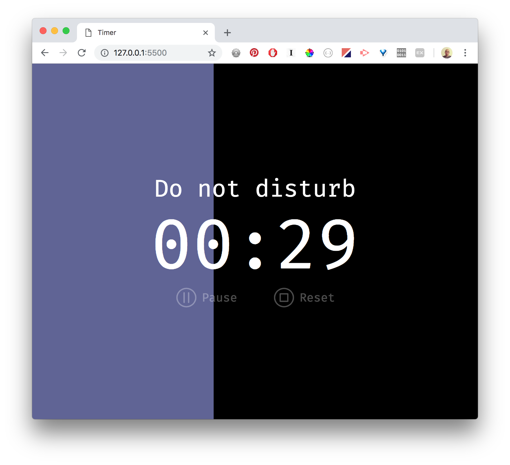

# Timer over photos

---

### Summary
A personal app that functions as a digital family photo album and as a pomodoro 25-minute timer. 

---

### Photo Viewer

- Built on Flickity
- Swipe (or click-drag) left/right to browse photos
- Default to autoplay, which pauses upon any user interaction.
  
---

### Timer       

- Timer icon on the top right corner will launch this feature.
- Screen prompts an unmistakable countdown clock with a _do not disturb_ message for more focused work.
- By default the counter is set at 25 minutes--based on the Pomodoro method--which is easily configurable by modifying `totalSeconds` value in seconds. Can be found in `/js/src/app.js`.

---

### Generate Resource List

1. `cd` into `/server-load/` folder
2. Run the following to create a `JSON` file:
```javascript
$ npm run build
```
3. Make sure if `/data/images.json` file is created correctly.

---

### Build 

1. `cd` into `/js/` folder
2. Choose one of the following commands:
```javascript
// for development
$ npm run dev

// to watch for changes
$ npm run watch

// for production
$ npm run build
```

---

### Deploy

Nothing runs on the server-side. Once you finished `build`, simply put all the generated/provided static files on the server of your choice:
```
/
|
+-css
| +-main.css
|
+-data 
| +-images.json
|
+-js
| +-app.dist.js
|
+-index.html
```
